# Reminder BOT Discord (English)

This bot was created to help remind you of tasks and schedule reminders for tasks that need to be repeated at certain intervals.

To use this bot, follow these steps:
- Clone this repository: `git clone https://github.com/rafaelRizzo/reminder-bot-discord.git`

# Bot Configuration on Discord
If you have any doubts on how to configure the BOT on Discord, visit the official [Discord Developer Portal](https://discord.com/developers/applications)

Or follow the steps in the screenshots below:

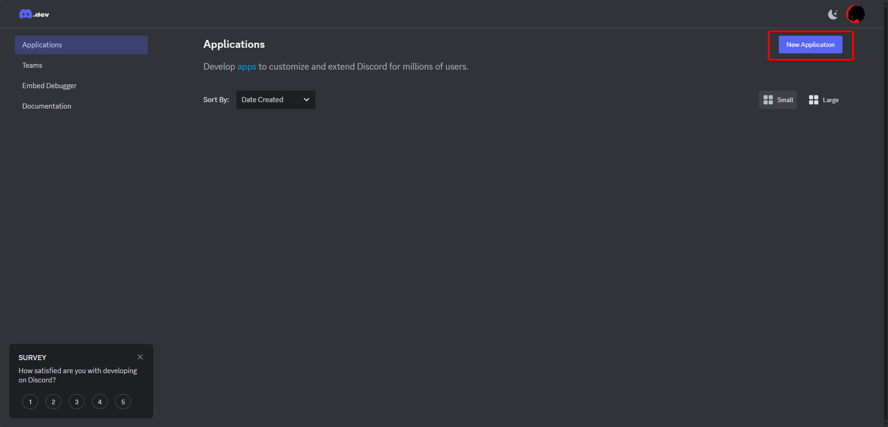
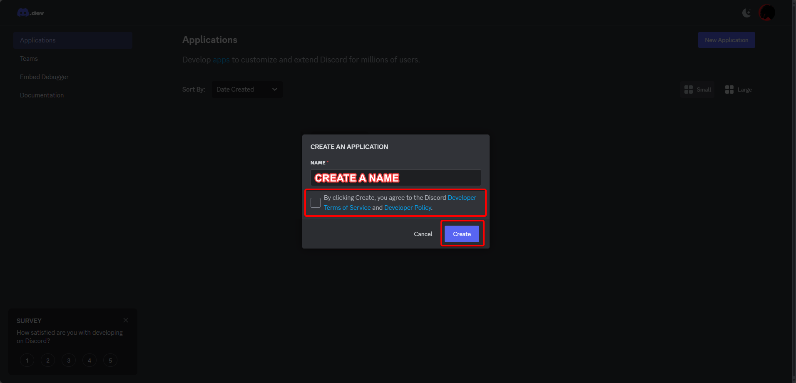
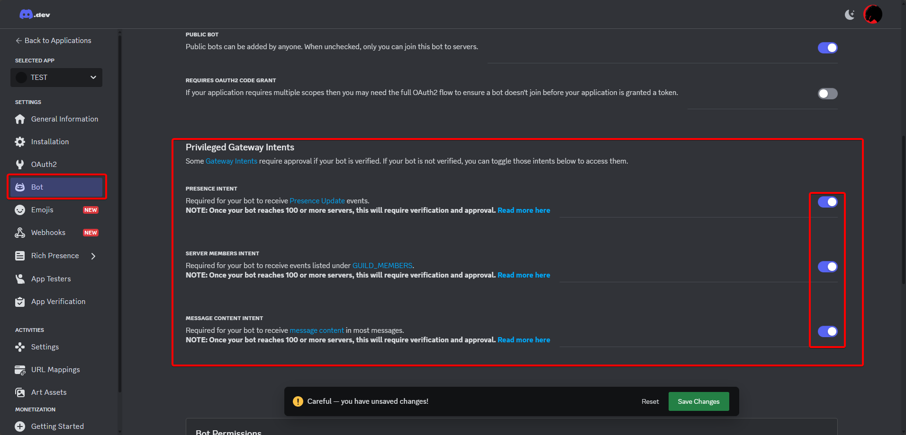
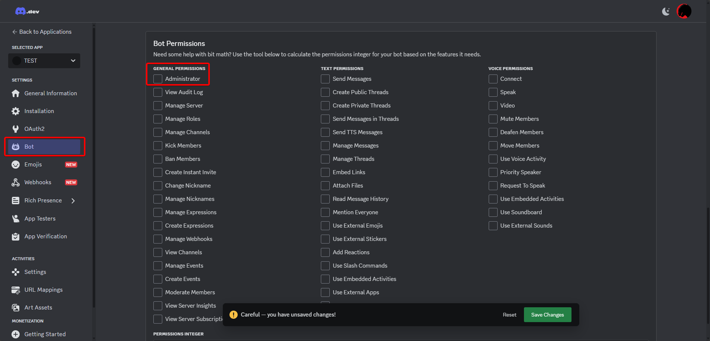
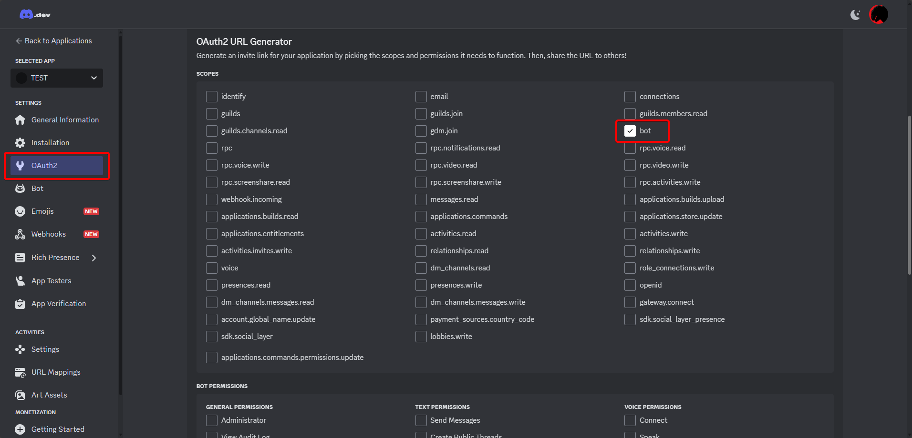
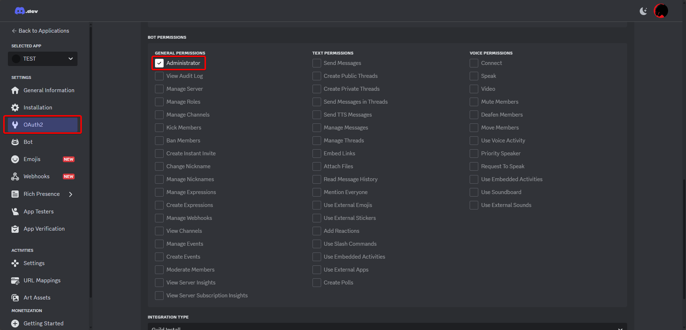

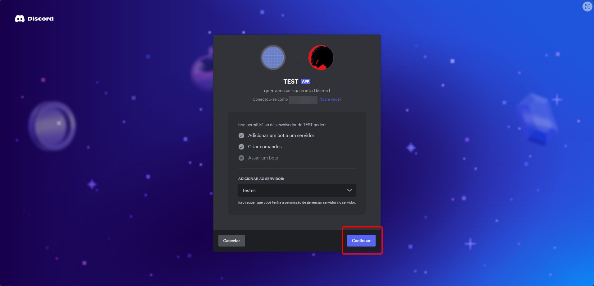
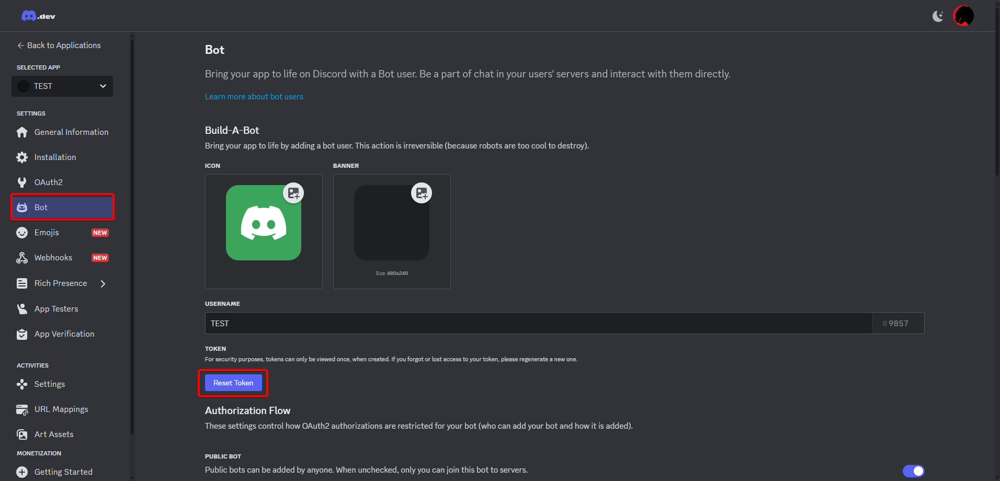
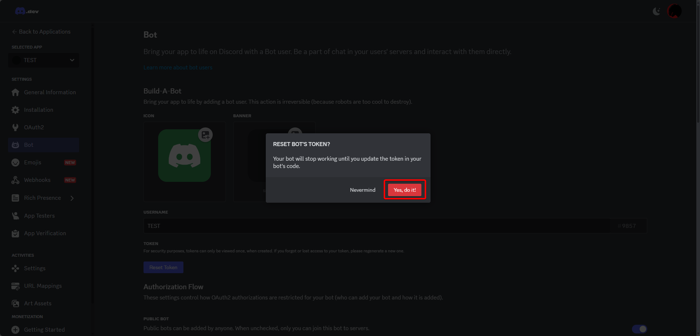
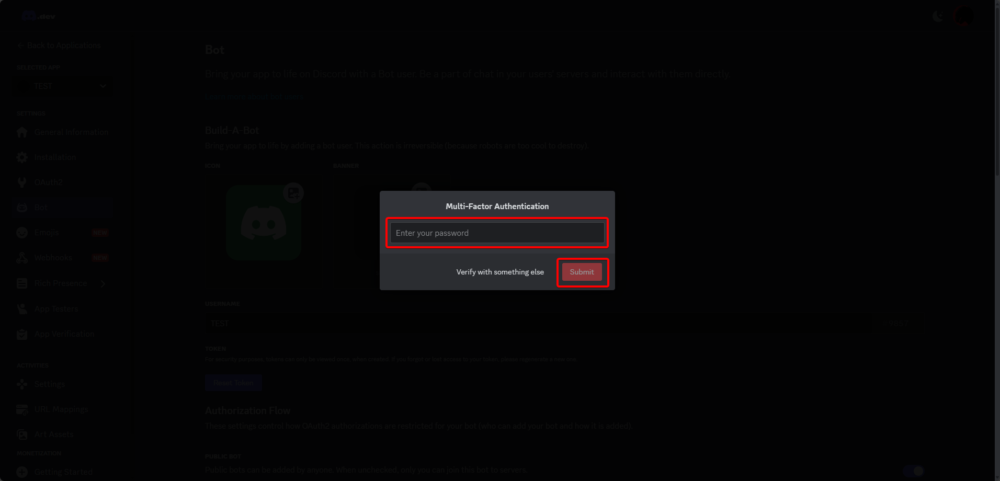
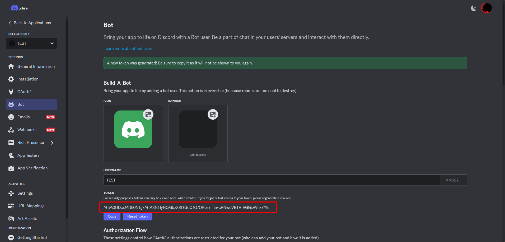

- Configure the `.env` file with your BOT details that you can access from this site.
- Run `npm install`
- Run `npm start`

Once the project is up and running, you should see it online in your server, and you can start using the bot in any text channel!

Start using the bot by typing `!help` to see all the available options.
